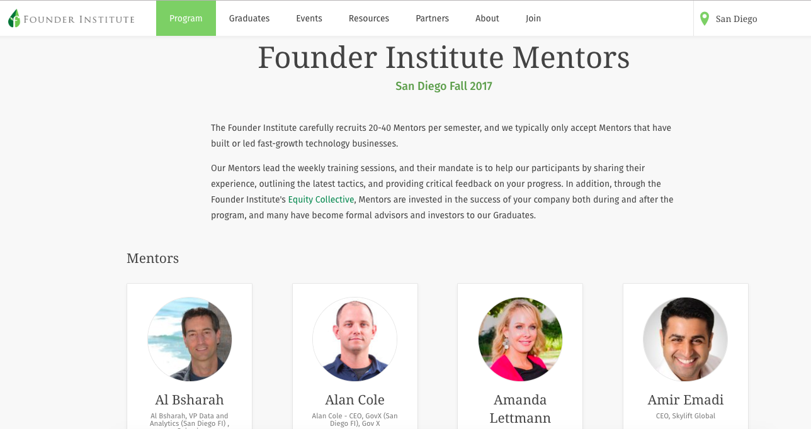

# Web-Scraping
The goal of this web scraping is to fetch all mentors' contacts of each location in global of Founder Institute (https://fi.co/) for the client to develop partership.

The number of locations in total is 128.
![](figs/
The infomation fetched is the mentors'name and their linkedin links.

